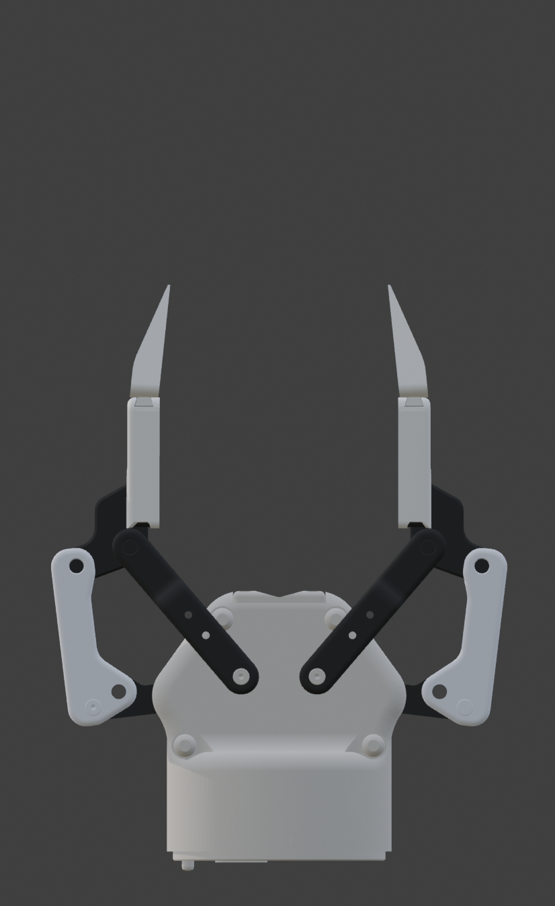
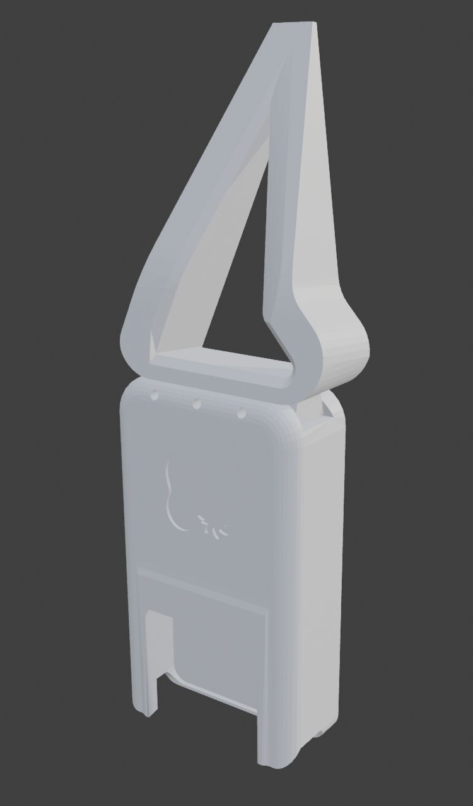
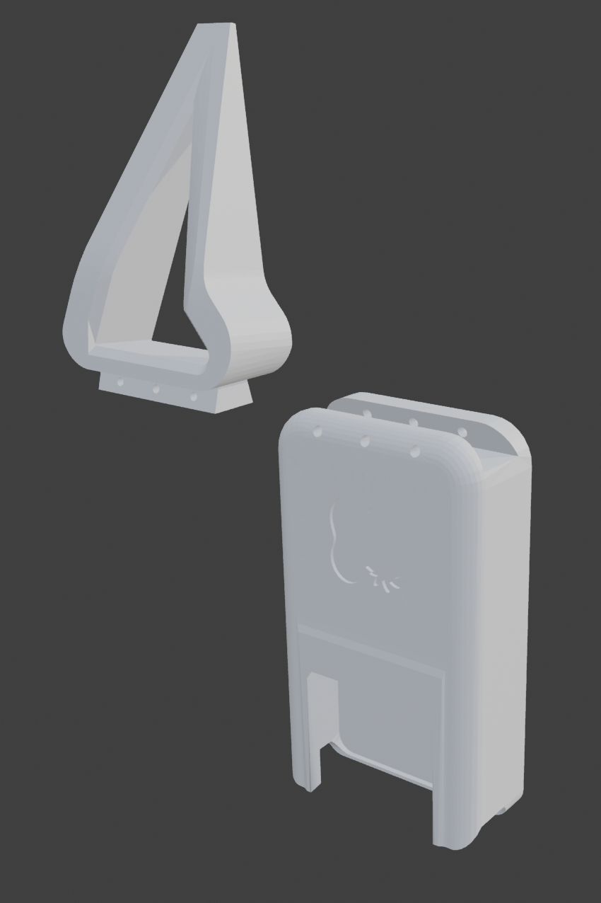
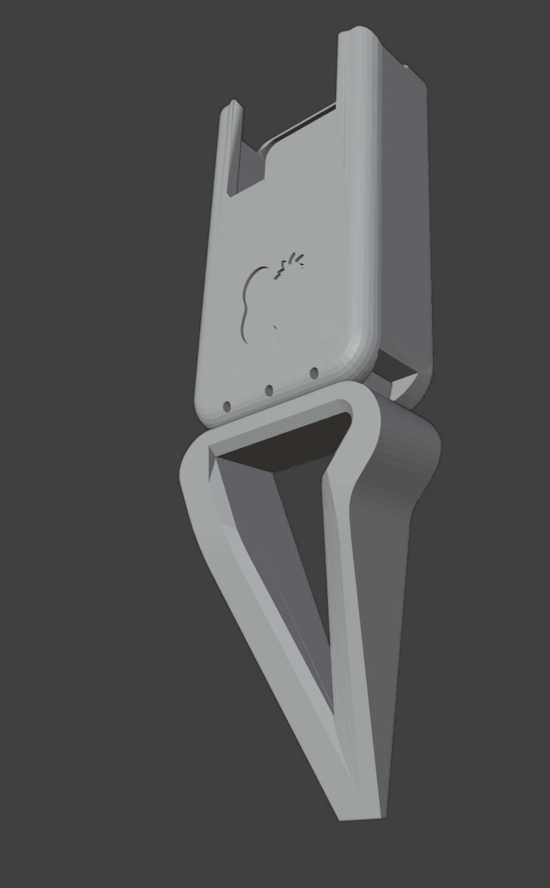
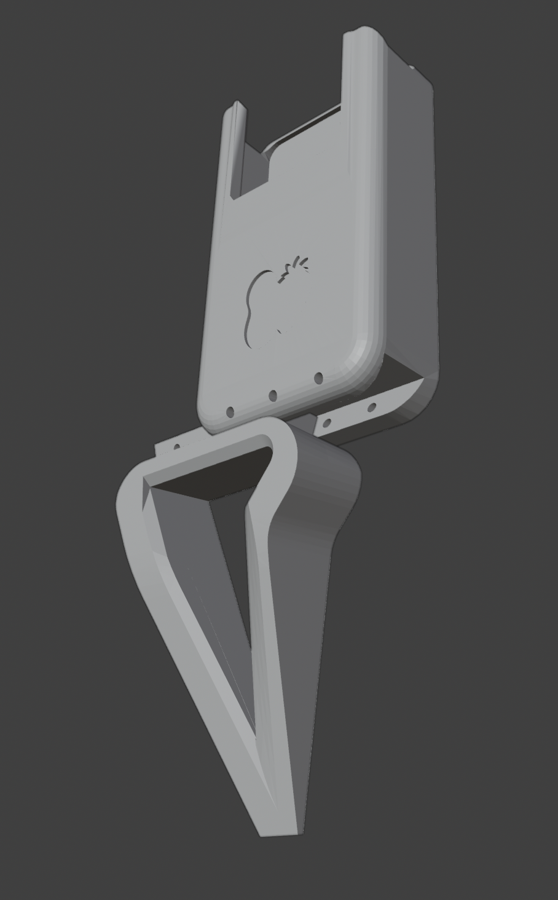
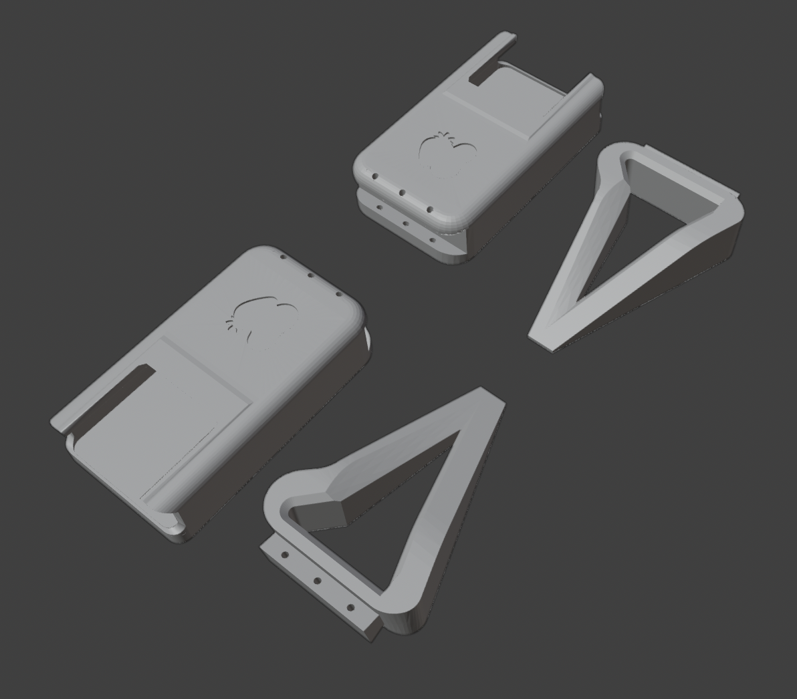
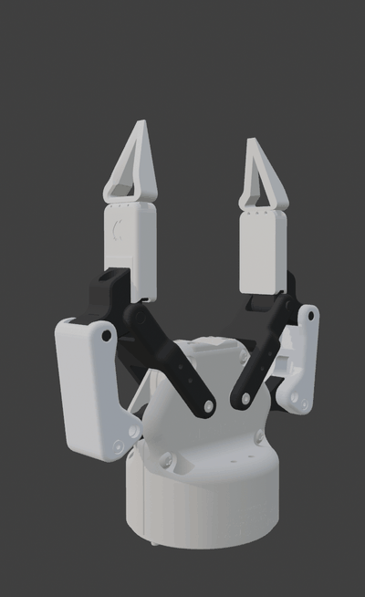

# GS_Pincher — Precision Pincher Tip

A pointed precision tip attachment for the [GripperSleeve Collection](../README.md), designed for the **Robotiq 2F-85** gripper.

## Overview

The GS_Pincher provides a narrow, pointed grip geometry for tasks requiring precision contact — small object manipulation, pick-and-place of thin or delicate parts, and pinch grasps on items where the stock flat pads are too wide.

| | |
|---|---|
|  |  |
| Open position | Closed position |

## Parts

Each finger requires **two printed parts** (four total for both fingers):

1. **Sleeve** — snaps over the stock Robotiq 2F-85 finger pad
2. **Pincher tip** — slides onto the sleeve

 | 
---|---

### Exploded View

### Wireframe Views

| | |
|---|---|
|  |  |
| Tip geometry | Sleeve geometry |

## Assembly

1. **Slide the sleeve** onto the Robotiq 2F-85 finger pad. It is a friction/snap fit — no tools or hardware required.
2. *(Optional)* If your application involves significant front-to-back forces, **bolt the sleeve down** using the built-in screw holes.
3. **Slide the pincher tip** onto the sleeve until it seats.
4. Repeat for the second finger.

To swap to a different tip, pull the pincher tip off the sleeve and slide on the replacement. The sleeve stays mounted.

 | 
---|---

## Print Layout

The STL contains all four parts (2 sleeves + 2 tips). Orientation as shown:

## Suggested Print Settings

| Parameter | Recommendation |
|---|---|
| **Material** | PLA or PETG (PETG preferred for durability) |
| **Layer height** | 0.2 mm |
| **Infill** | 40–60% (higher for more rigidity) |
| **Supports** | May be needed for sleeve overhang — check slicer preview |
| **Walls/perimeters** | 3+ for structural strength |

*These are starting-point suggestions. Adjust based on your printer and use case.*

## Files

| File | Description |
|---|---|
| `GS_Pincher.stl` | Pincher tips only |
| `GS_Pincher_incl_Sleeve.stl` | Pincher tips + sleeves combined |
| `GS_Pincher_00.png` – `GS_Pincher_10.png` | Rendered views |
| `GS_Pincher_Wire_00.png`, `GS_Pincher_Wire_01.png` | Wireframe views |
| `GS_Pincher_Printlayout.png` | Print orientation reference |
| `GS_Pincher_Turntable.gif` | Animated 360° turntable |
| `Turntable/` | 360° turntable render sequence (individual frames) |

## Turntable

  

Individual frames are available in the [`Turntable/`](Turntable/) subfolder (13 frames).

## License

[CC BY-NC-ND 4.0](https://creativecommons.org/licenses/by-nc-nd/4.0/) — see [LICENSE](../LICENSE).

**Author:** Emma L. D. Lieker
