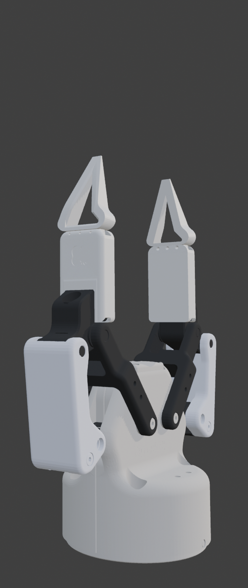
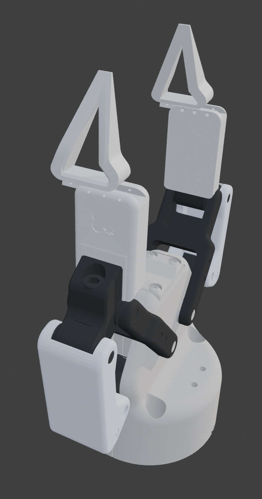
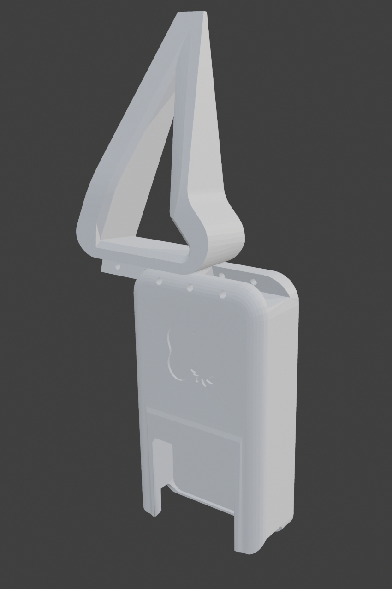
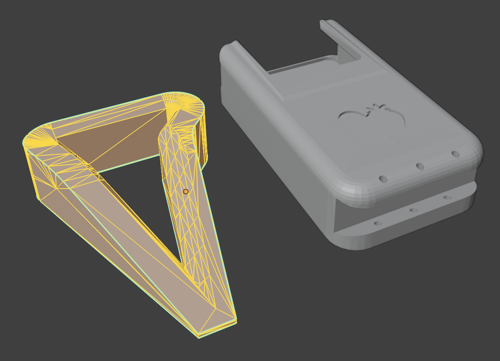
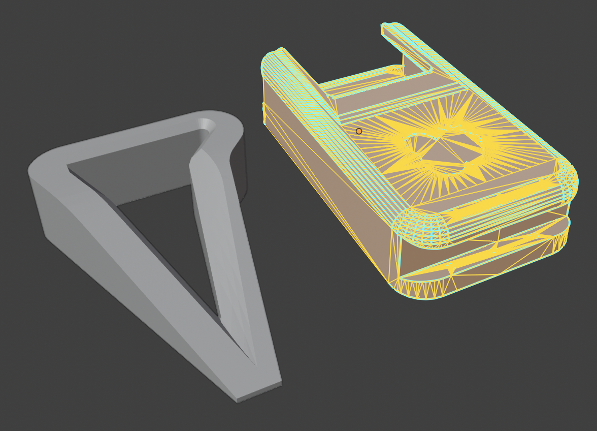
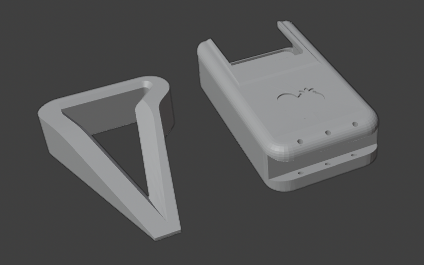

# GS_Pincher — Precision Pincher Tip

A pointed precision tip attachment for the [GripperSleeve Collection](../README.md), designed for the **Robotiq 2F-85** gripper. The precision tips slide on to the gripper sleeve without screws or any further hardware required. 

  

## Overview

The GS_Pincher provides a narrow, pointed grip geometry for tasks requiring precision contact — small object manipulation, pick-and-place of thin or delicate parts, and pinch grasps on items where the stock flat pads are too wide.

The tip design is adapted from the [viperx_gripper_stl.stl](https://github.com/tonyzhaozh/aloha/blob/main/aloha2/viperx_gripper_stl.zip) from the Aloha2 project.

Each finger requires **two printed parts** (four total for both fingers):

1. **Sleeve** — snaps over the stock Robotiq 2F-85 finger pad
2. **Pincher tip** — slides onto the sleeve (optional fixation of the slider via screwholes)

 

## Assembled & Disassembled Views

| | Front | Side |
|---|---|---|
| **Assembled** |  |  |
| **Disassembled** |  |  |

## Slide-On Assembly

The sleeve clips directly onto the stock Robotiq 2F-85 finger pad via friction fit. Optional screw holes are built in for bolting the sleeve down under front-to-back forces.

The pincher tip then slides onto the sleeve — no tools or hardware needed.

 

| Off | Mid | On |
|---|---|---|
|  |  |  |

## Wireframe Views

| Tip geometry | Sleeve geometry |
|---|---|
|  |  |

## Assembly Instructions

1. **Slide the sleeve** onto the Robotiq 2F-85 finger pad. It is a friction/snap fit — no tools or hardware required.
2. *(Optional)* If your application involves significant front-to-back forces, **bolt the sleeve down** using the built-in screw holes.
3. **Slide the pincher tip** onto the sleeve until it seats.
4. Repeat for the second finger.

To swap to a different tip, pull the pincher tip off the sleeve and slide on the replacement. The sleeve stays mounted.

## Print Layout

The combined STL contains all four parts (2 sleeves + 2 tips). Orientation as shown:

| Layout | Parts |
|---|---|
|  |  |

## Suggested Print Settings

| Parameter | Recommendation |
|---|---|
| **Material** | PETG recommended; PLA also works. PA (Nylon) is fine for higher wear resistance. |
| **Layer height** | 0.2 mm |
| **Infill** | 40–60% (higher for more rigidity) |
| **Supports** | May be needed for sleeve overhang — check slicer preview. Consider tree supports. |
| **Walls/perimeters** | 3+ for structural strength |

*These are starting-point suggestions. Adjust based on your printer and use case.*

## Files

| File | Description |
|---|---|
| `GS_Pincher.stl` | Pincher tips only |
| `GS_Pincher_incl_Sleeve.stl` | Pincher tips + sleeves combined |
| `GS_Pincher_00_Turntable.gif` | Animated 360° turntable |
| `GS_Pincher_01_front_Assembled/Disassembled.png` | Front views |
| `GS_Pincher_01_side_Assembled/Disassembled.png` | Side views |
| `GS_Pincher_02_Slide*.png` | Slide-on assembly sequence |
| `GS_Pincher_03_Print_Layout.png` | Print orientation reference |
| `GS_Pincher_03_Print_Parts.png` | Individual parts |
| `GS_Pincher_03_Wire_00.png`, `GS_Pincher_03_Wire_01.png` | Wireframe views |

## License

[CC BY-NC-ND 4.0](https://creativecommons.org/licenses/by-nc-nd/4.0/) — see [LICENSE](../LICENSE).

**Author:** Emma L. D. Lieker
