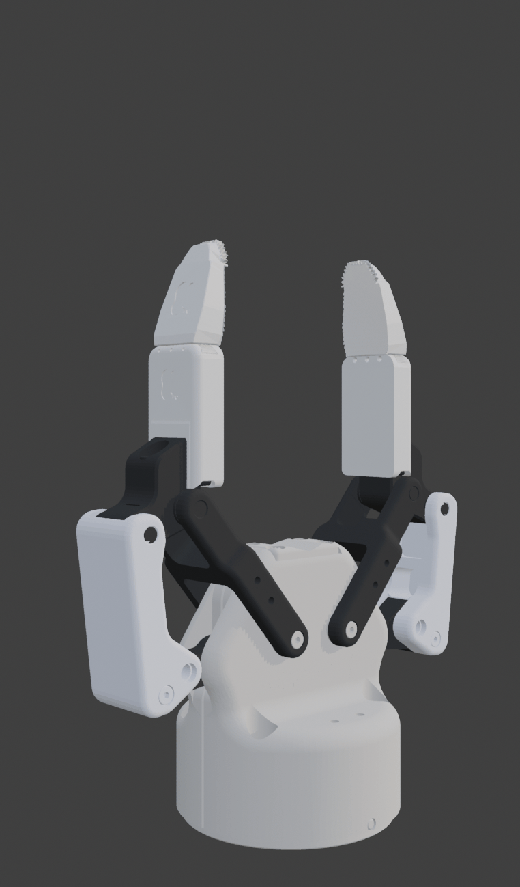
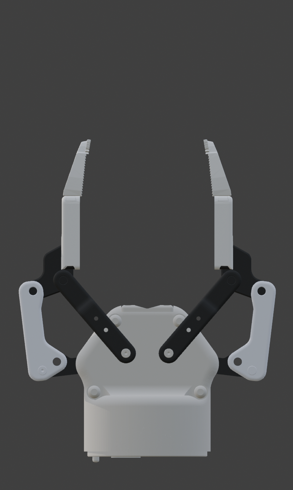
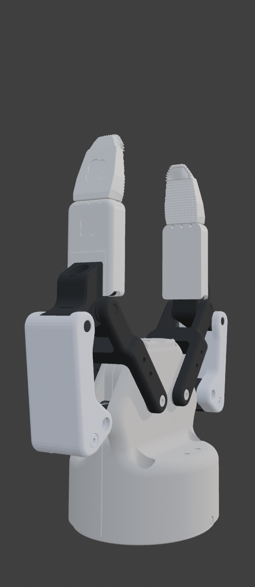
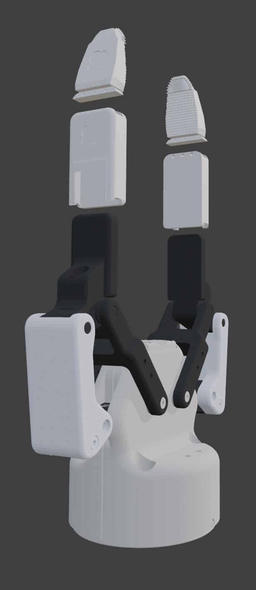
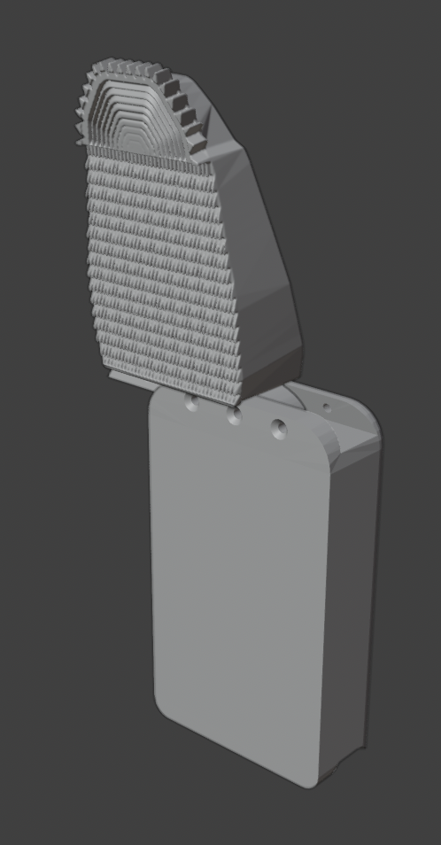
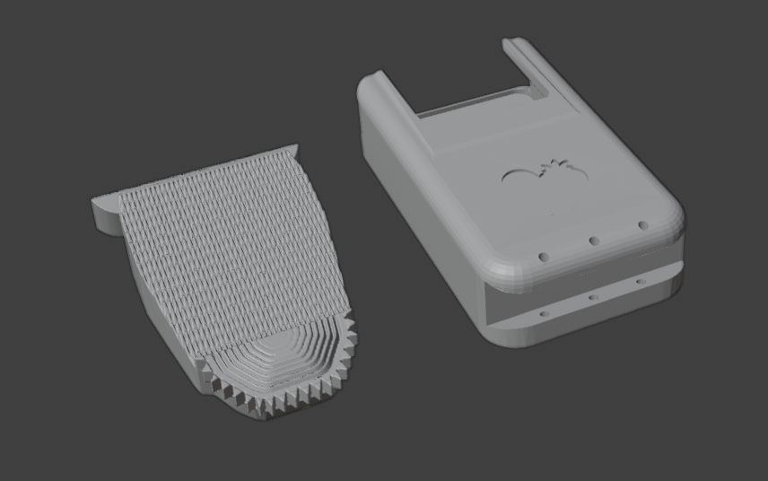

# GS_Rough — High-Friction Textured Tip

A textured grip tip attachment for the [GripperSleeve Collection](../README.md), designed for the **Robotiq 2F-85** gripper.

  

## Overview

The GS_Rough provides a high-friction grip surface for tasks where the stock flat pads can't hold reliably — smooth, slippery, or cylindrical objects. The contact face features a dense array of raised nubs, and the top edge is serrated for additional purchase.

Each finger requires **two printed parts** (four total for both fingers):

1. **Sleeve** — snaps over the stock Robotiq 2F-85 finger pad
2. **Rough tip** — slides onto the sleeve

 

## Assembled & Disassembled Views

| | Front | Side |
|---|---|---|
| **Assembled** |  |  |
| **Disassembled** |  |  |

## Slide-On Assembly

| Inner view | Outer view |
|---|---|
|  |  |

The sleeve clips directly onto the stock Robotiq 2F-85 finger pad via friction fit. Optional screw holes are built in for bolting the sleeve down under front-to-back forces. The rough tip then slides onto the sleeve — no tools or hardware needed.

## Wireframe Views

| Tip geometry | Sleeve geometry |
|---|---|
|  |  |

## Assembly Instructions

1. **Slide the sleeve** onto the Robotiq 2F-85 finger pad. It is a friction/snap fit — no tools or hardware required.
2. *(Optional)* If your application involves significant front-to-back forces, **bolt the sleeve down** using the built-in screw holes.
3. **Slide the rough tip** onto the sleeve until it seats.
4. Repeat for the second finger.

To swap to a different tip, pull the rough tip off the sleeve and slide on the replacement. The sleeve stays mounted.

## Print Layout

The combined STL contains all four parts (2 sleeves + 2 tips). Orientation as shown:

| Layout | Parts |
|---|---|
|  |  |

## Suggested Print Settings

| Parameter | Recommendation |
|---|---|
| **Material** | PLA or PETG (PETG preferred for durability) |
| **Layer height** | 0.2 mm |
| **Infill** | 40–60% (higher for more rigidity) |
| **Supports** | May be needed for textured surface overhang — check slicer preview |
| **Walls/perimeters** | 3+ for structural strength |

*These are starting-point suggestions. Adjust based on your printer and use case.*

## Files

| File | Description |
|---|---|
| `GS_Rough.stl` | Rough tips only |
| `GS_Rough_inclSleeves.stl` | Rough tips + sleeves combined |
| `GS_Rough_00_Turntable.gif` | Animated 360° turntable |
| `GS_Rough_01_front_Assembled/Disassembled.png` | Front views |
| `GS_Rough_01_side_Assembled/Disassembled.png` | Side views |
| `GS_Rough_02_Slider_inner.png`, `GS_Rough_02_Slider_outer.png` | Slide-on assembly |
| `GS_Rough_03_Print_Layout.png` | Print orientation reference |
| `GS_Rough_03_Print_Parts.png` | Individual parts |
| `GS_Rough_03_Wire_00.png`, `GS_Rough_03_Wire_01.png` | Wireframe views |
| `Turntable/` | 360° turntable render sequence (individual frames) |

## License

[CC BY-NC-ND 4.0](https://creativecommons.org/licenses/by-nc-nd/4.0/) — see [LICENSE](../LICENSE).

**Author:** Emma L. D. Lieker
