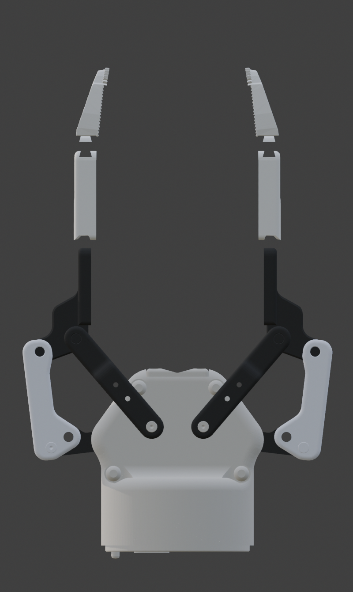
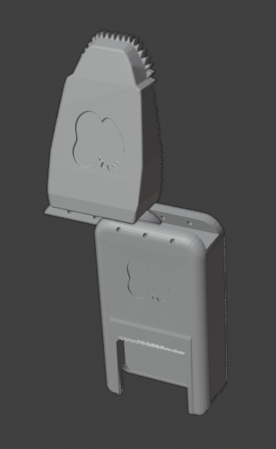
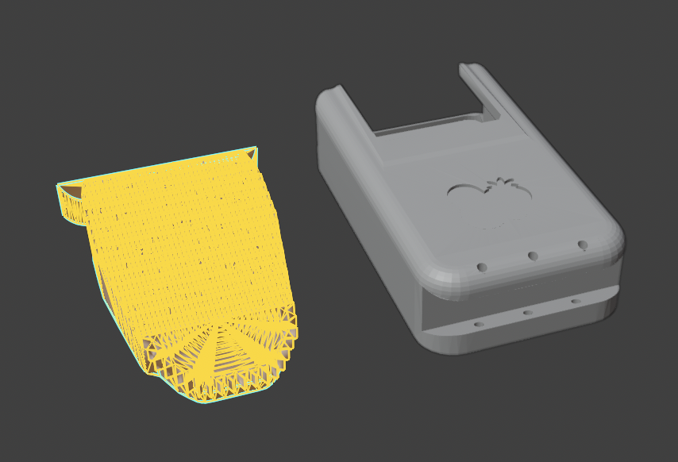
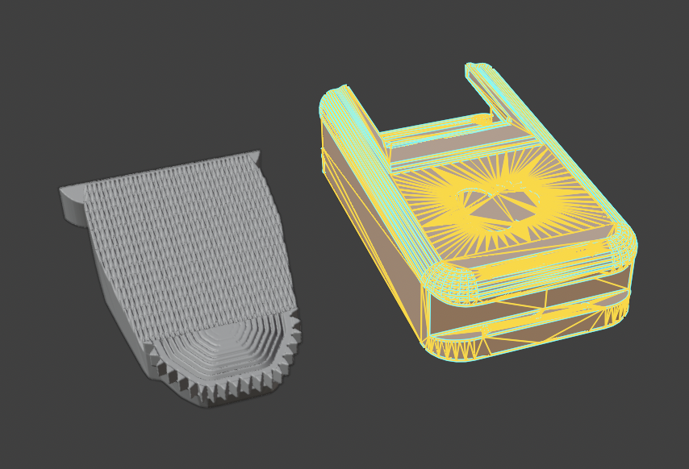
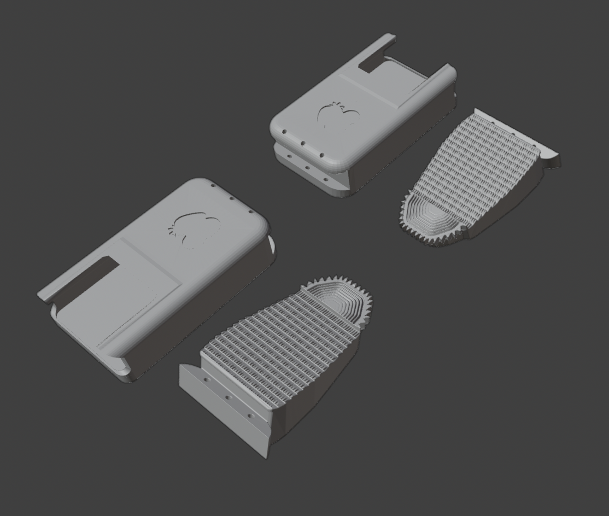

# GS_Rough — High-Friction Textured Tip

A textured grip tip attachment for the [GripperSleeve Collection](../README.md), designed for the **Robotiq 2F-85** gripper.

  

## Overview

<table align="left"><tr>
<td><strong>Assembled</strong> </td>
<td><strong>Disassembled</strong> </td>
</tr></table>

The GS_Rough provides a high-friction grip surface for tasks where the stock flat pads can't hold reliably — smooth, slippery, or cylindrical objects. The contact face features a dense array of raised nubs, and the top edge is serrated for additional purchase.

Each finger requires **two printed parts** (four total for both fingers):

1. **Sleeve** — snaps over the stock Robotiq 2F-85 finger pad
2. **Rough tip** — slides onto the sleeve

 

## Slide-On Assembly

The sleeve clips directly onto the stock Robotiq 2F-85 finger pad via friction fit. Optional screw holes are built in for bolting the sleeve down under front-to-back forces. The rough tip then slides onto the sleeve — no tools or hardware needed.

 

## Wireframe Views

| Tip geometry | Sleeve geometry |
|---|---|
|  |  |

## Assembly Instructions

1. **Slide the sleeve** onto the Robotiq 2F-85 finger pad. It is a friction/snap fit — no tools or hardware required.
2. *(Optional)* If your application involves significant front-to-back forces, **bolt the sleeve down** using the built-in screw holes.
3. **Slide the rough tip** onto the sleeve until it seats.
4. Repeat for the second finger.

To swap to a different tip, pull the rough tip off the sleeve and slide on the replacement. The sleeve stays mounted.

## Print Layout

| Layout | Parts |
|---|---|
|  |  |

## Suggested Print Settings

| Parameter | Recommendation |
|---|---|
| **Material** | PETG recommended; PLA also works. PA (Nylon) is fine for higher wear resistance. |
| **Layer height** | 0.2 mm |
| **Infill** | 40–60% (higher for more rigidity) |
| **Supports** | May be needed for textured surface overhang — check slicer preview |
| **Walls/perimeters** | 3+ for structural strength |

*These are starting-point suggestions. Adjust based on your printer and use case.*

## Files

| File | Description |
|---|---|
| `GS_Rough.stl` | Rough tips only |
| `GS_Rough_inclSleeves.stl` | Rough tips + sleeves combined |
| `Demo/` | All rendered views, turntable GIF, wireframes, and print layout images |

## License

[CC BY-NC-ND 4.0](https://creativecommons.org/licenses/by-nc-nd/4.0/) — see [LICENSE](../LICENSE).

**Author:** Emma L. D. Lieker
