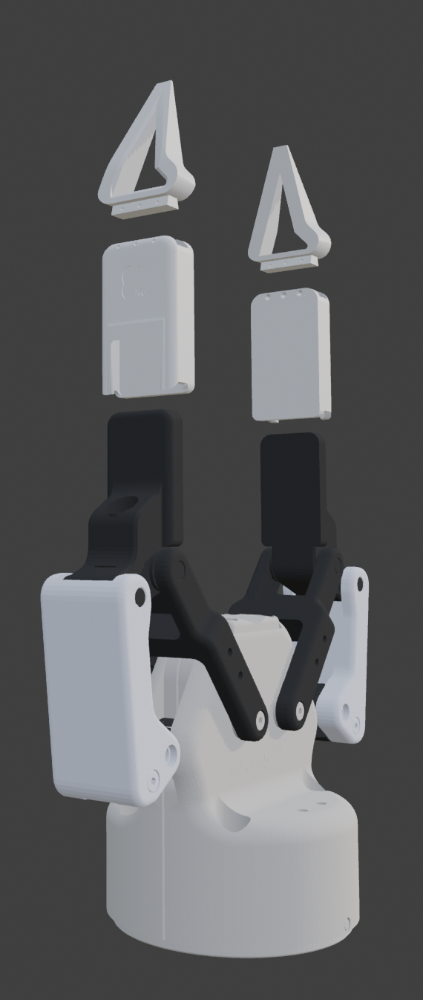
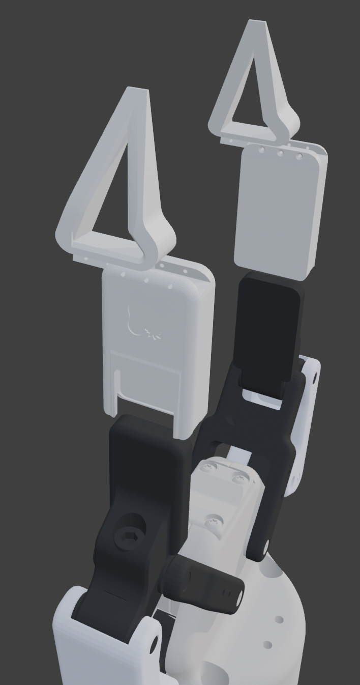

# GripperSleeve Collection — Robotiq 2F-85

A growing, open-source collection of 3D-printable, slide-on gripper attachments for the **Robotiq 2F-85** adaptive gripper. Snap- and slide-fit: no hardware needed for assembly.

<p align="center">
  
</p>

## What Is This?



The Robotiq 2F-85 is a widely used industrial gripper, but its stock finger pads are general-purpose. Different tasks — precision picks, soft-object handling, cylindrical grasps — benefit from different tip geometries.

This project provides a **modular sleeve-and-tip system**:

1. **Sleeve** — a 3D-printed cover that snaps onto the stock Robotiq 2F-85 finger pad (pure friction fit, no hardware required).
2. **Exchangeable tips** — attachments that slide onto the sleeve, each optimized for a specific grip type.

Swap tips in seconds without tools. Print what you need.

<br clear="both">

## How It Works



1. **Print** the sleeve and tip for your chosen attachment (STL files in each subfolder).
2. **Slide the sleeve** onto the Robotiq 2F-85 finger pad — it snaps on with a friction fit. Optional screw holes are provided if you need to bolt the sleeve down for front-to-back force resistance.
3. **Slide the tip** onto the sleeve — again, pure slide-on fit.
4. To swap tips, pull off the current tip and slide on a different one. The sleeve stays in place.

<br clear="both">

## Available Attachments

| Attachment | Description | Folder |
|---|---|---|
| **GS_Pincher** | Pointed precision tip for small-object and pinch grasps | [`GS_Pincher/`](GS_Pincher/) |

*More attachments coming soon.*

## Repository Structure

```
GripperSleeve_Collection/
├── README.md                       ← You are here
├── LICENSE                         ← CC BY-NC-ND 4.0
├── .gitignore
├── GS_Sleeve_Robotiq2F85.stl      ← Standalone sleeve (shared across all tips)
│
├── GS_Pincher/                     ← First attachment
│   ├── README.md                   ← Attachment-specific details & print settings
│   ├── GS_Pincher.stl              ← Pincher tips only
│   ├── GS_Pincher_incl_Sleeve.stl  ← Pincher tips + sleeves combined
│   ├── GS_Pincher_*.png            ← Renders and screenshots
│
└── GS_[...]/                    ← Future attachments follow the same layout
    ├── README.md
    ├── *.stl
    └── ...
```

## Compatibility

Designed for the **Robotiq 2F-85** adaptive gripper. The sleeve geometry is modeled against the stock finger pad dimensions; other Robotiq models have not been tested.

## License

This work is licensed under [CC BY-NC-ND 4.0](https://creativecommons.org/licenses/by-nc-nd/4.0/).

**You may** share and redistribute the files in any medium for non-commercial purposes, as long as you give appropriate credit and do not distribute modified versions.

**You may not** use these designs commercially or distribute modified versions without explicit permission from the author.

### Attribution

When sharing, please credit:

> GripperSleeve Collection for Robotiq 2F-85 by **Emma L. D. Lieker**
> Licensed under CC BY-NC-ND 4.0 — https://creativecommons.org/licenses/by-nc-nd/4.0/

## Author

**Emma L. D. Lieker**
